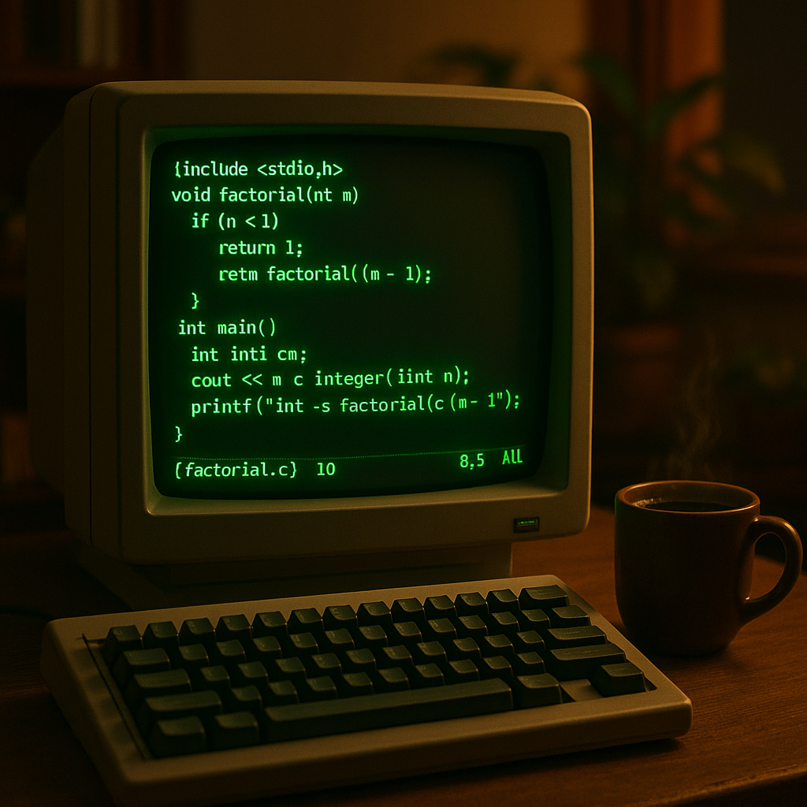

+++
title = "Back to Blogging: Keeping Basetta Up-to-Date"
date = 2025-09-12
draft = false
description = "Returning to technical blogging in a world of AI by building my own text editor in C, old-school style."
+++

# Back to Blogging: Keeping Basetta Up-to-Date

It feels almost surreal logging into my own blog after such a long pause.
More than five years have passed since I last hit “publish,” and so much has changed—both in technology and in my life.
I genuinely missed working through problems, untangling ideas, 
and sharing discoveries from my technical journey.

Looking at some of my old posts on Git tricks and file recovery, I’m reminded that this blog wasn’t just a place to share useful info—it was a way for me to mark my own progress and experiments. There were nights when troubleshooting and tinkering with code sparked late blog entries, and times when finding a new solution felt worth documenting.

The truth is, my break wasn’t planned. Life got busy and priorities shifted, but throughout it all this site lingered in my mind as a creative anchor. Now, as AI becomes more embedded in every tool and workflow, I feel drawn to my roots—a world where writing, coding, and problem-solving happen in a more hands-on, personal way.

To that end, I’ve started working on something new (and a little old-school): building my own text editor in C, writing entirely in nvim and following the legendary “Build Your Own Text Editor” tutorial. The guide takes you step by step through creating a powerful editor based on antirez’s kilo, letting you experience every feature from the ground up. In a time when AI promises shortcuts and automated suggestions, there’s something deeply satisfying about crafting and understanding every line on your own.

From now on, I’m committed to keeping Basetta’s site current, sharing technical deep-dives, experiments, and reflections on what it means to build tools yourself—even in the age of AI. For those interested in hands-on development, practical guides, and the personal side of programming, I hope this fresh start brings both insights and a sense of creative independence.

